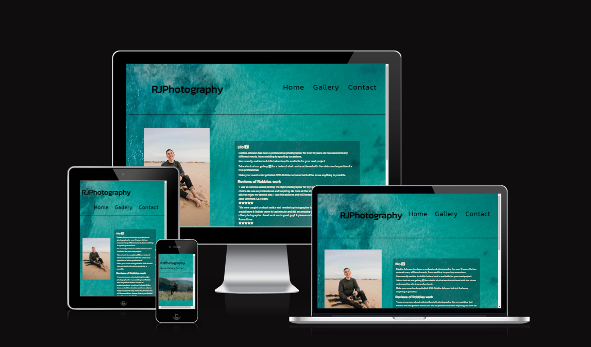

# RJPhoptography

This site is to showcase a (fictional) photographers work and give users the chance to view a sample of his work and an ability to contact him directly.

I built it to demonstrate the abilities i have learned so far, and for course evaluation.
This is a multi page site with links to each page. It contains a Home(about), Gallery, and a Contact form with a thank you message that refreshes to the main page. 

The site is responsive across different screen sizes. 

https://seanorourke7.github.io/rjphotography/

---

## CONTENTS

* [User Experience](#user-experience-ux)
  * [User Stories](#user-stories)

* [Design](#design)
  * [Colour Scheme](#colour-scheme)
  * [Typography](#typography)
  * [Imagery](#imagery)
  * [Wireframes](#wireframes)

* [Features](#features)
  * [General Features on Each Page](#general-features-on-each-page)
  * [Future Implementations](#future-implementations)
  * [Accessibility](#accessibility)

* [Technologies Used](#technologies-used)
  * [Languages Used](#languages-used)

  * [Deployment](#deployment)
    * [How to Fork](#how-to-fork)
    * [How to Clone](#how-to-clone)

* [Testing](#testing)

* [Credits](#credits)
  * [Code Used](#code-used)
  * [Content](#content)
  * [Media](#media)
  * [Acknowledgments](#acknowledgments)

---

## User Experience (UX)

### User Stories

First time visitors will be greeted by a clean homepage with clear information. 

In the center there is a portrait of the photographer and a short bio with some reviews.

The header content reacts with hover to invite interaction and leads the user through the site.

The gallery is accessable through the header and also through the hyperlink in the bio.

The header, footer and background image are consistant across all pages to help with the flow.

The logo at the top of the page will also react on hover and bring the user to the home page.

The socials in the footer stand out againt the background image and are intuatively placed.

The contact form is clearly labeled and the submit button reacts on hover to encourage interaction. All fields are set to their specified content and will give feedback if wrong or missing info is entered. 

Repeat visitors will benefit from updated gallerys of recent work and updated reviews as they are published.  

## Design

### Colour Scheme

The colour scheme is based on the background image of the sea arriving on the beach. This image was used as it has a natural flow from top to bottom starting from a dark cyan and transitioning naturally to a light brown. 

It works well in this case as it helps with the natural flow of a website and the intuitive nature of where the header body and footer are located. 

All sections within the image are offset to apear almost translucent to the background.

This allows for the use of black and white font and keeps the colour scheme simple and effective. 

### Typography

I've used Kanit font as it is buisness like while also maintaining a modern style. 

It's easy to read and looks well when used as headers and paragraphs. This means I can use it across the site and keep the flow of the site intact. 

assets/images/readme/kanitfont.jpg

### Imagery

All images used are copyright free images from www.pexels.com. They show a range of subjects to show off the photographers skillset. Weddings, corporate events, music events and drone images. 

### Wireframes

I drew out the wireframes with pen and paper and then worked from that template into the site. 
The structure changed slightly as I went through the process of developing it but it still maintained the basic idea of the original layout. 

assets/images/readme/wireframe-homepage.png
assets/images/readme/wireframe-gallery.png
assets/images/readme/wireframe-contact.png

## Features

This site contains a home page with some information about the photographer and reviews of his work. 

assets/images/readme/home-desktop.png

assets/images/readme/home-mobile.png

A gallery page that shows a selection of his work.

assets/images/readme/gallerydesktop1.png

assets/images/readme/gallery-mobile.png

A contact page that captures a name, email and message.

assets/images/readme/contactdesktop1.png

assets/images/readme/contact-mobile.png

And a thank you message that auto refreshes to the homepage. 

assets/images/readme/thankyou-desktop1.png

assets/images/readme/thankyou-mobile.png

### General features on each page

There is a header that is consitant across all pages. It contains a link to each page , Home , Gallery, and About. The header also contains the logo which will also link back to the home page. 

assets/images/readme/header.png

The footer is consistant across all pages and links to the social media accounts. 

assets/images/readme/footer.png

### Future Implementations

I would like to add a more interactive gallery that allows browsing by genre and another page for video footage. 

### Accessibility

All images have aria labels with descriptive text. 
The font and colour scheme work well and accessability on lighthouse is 100%. 

## Technologies Used

Github - To save and store the files for the website.
Codeacadmy - to write the code.
Google Fonts - To import the fonts used on the website.
Font Awesome - For the iconography on the website.
Google Dev Tools - To troubleshoot and test features, solve issues with responsiveness and styling.
Tiny PNG To compress images.
Am I Responsive? To show the website image on a range of devices.

### Languages Used

HTML & CSS.

### Deployment

Deployment

Github Pages was used to deploy the live website. The instructions to achieve this are below:

Log in (or sign up) to Github.
Find the repository for this project, rjphotography.
Click on the Settings link.
Click on the Pages link in the left hand side navigation bar.
In the Source section, choose main from the drop down select branch menu. Select Root from the drop down select folder menu.
Click Save. Your live Github Pages site is now deployed at the URL shown.

#### How to Fork

How to Fork
To fork the rjphotography repository:

Log in (or sign up) to Github.
Go to the repository for this project, seanorourke7/rjphotography.
Click the Fork button in the top right corner.

#### How to Clone

How to Clone
To clone the rjphotography repository:

Log in (or sign up) to GitHub.
Go to the repository for this project, seanorourke7/rjphotography.
Click on the code button, select whether you would like to clone with HTTPS, SSH or GitHub CLI and copy the link shown.
Open the terminal in your code editor and change the current working directory to the location you want to use for the cloned directory.
Type 'git clone' into the terminal and then paste the link you copied in step 3. Press enter.

## Testing

Testing was ongoing throughout the entire build. I utilised Chrome developer tools while building to pinpoint and troubleshoot any issues as I went along.

The following feedback was raised during my mid project meeting with my mentor:

The gallery mentioned in the bio should act as a link to the gallery page. 
There should be more images in the gallery.
The contact message box wasnt set so it couldnt be maipulated and ruin the style, and the background color wasnt the same as the rest of the contact page. 
The contact page initially just linked to a default page from a previous project (love running) this was advised to be changed to a 4th page with a thank you message. 

Bugs

When sizing down to mobile the 3 columns in the gallery were too small to see so I changed the media queries to 2 columns below 750px. 
Initally the contact form was 10% from the left and this caused an issue with the flow of the page when viewed on mobile so i changed it to 1%. 
The images initially would display fine on the live site but not in the working environment of codeanywhere. I had to change the address to all images so they would display on both. 

No bugs were identified in HTML or CSS validators. 

assets/images/readme/jigsaw-validator.png

assets/images/readme/w3c-validator.png

assets/images/readme/pagespeed.png

## Credits

Most of what I learned for this project came from the love-running project from code institute. 
I have recieved help and feedback particularly around the thank you page from Graeme Taylor my mentor.

### Code Used

I re-used code from the love running project for the gallery styling.
#pictures {
    clear: both;
    line-height: 0;
    column-count: 3;
    column-gap: 0px;
}

### Content

The site was written by me and is entirely fictional. 

###  Media

All images used are copyright free from www.pexels.com.
  
###  Acknowledgments

Graeme Taylor my mentor helped me a lot with this project and I got some feedback from Alan B. the cohort facilitator with code institute around the wording used in the header. Originaly it was "ABOUT" but I later changed it to "HOME".
The readme template was used from code insitute. 
And the Slack community for this project is a great help for community discorse and feedback.  

https://seanorourke7.github.io/rjphotography/

---
